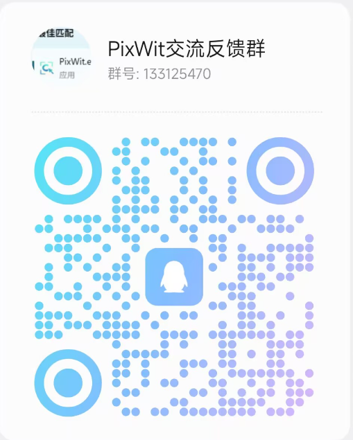

# PixWit - 截图 · 录屏 · 简易剪辑

> 🌐 官网：[https://pixwit.cn/](https://pixwit.cn/)

Windows 截图与录屏工具，集成基础视频剪辑能力：单屏快速截图、历史记录、丰富标注、桌面贴图；支持全屏/区域录屏、暂停/恢复、录制完成提示；内置视频裁剪、删除中间段、压缩与格式转换（含 GIF）。

## ✨ 主要特性

- 🖥️ **单屏截图** - 在哪个屏幕按F1就在哪个屏幕截图，简单快捷
- 📜 **历史截图** - 每次截图自动保存，系统托盘一键查看历史
- 🎯 **智能选区** - 拖拽选择特定区域，支持拖拽边框微调
- 🎨 **可视化调整** - 8个调整手柄，实时预览效果
- ✏️ **丰富编辑工具** - 画笔、直线、箭头、圆形、矩形、马赛克、文字
- 🔍 **OCR 文字识别** - 一键识别图片中的文字，自动复制到剪贴板
- 🖼️ **SVG矢量图标** - 清晰美观，适配任何DPI
- 📌 **便签贴图** - 创建可移动、可缩放的桌面贴图
- 💾 **快速保存** - 支持PNG格式
- 📋 **剪贴板支持** - 一键复制到剪贴板
- ⚡ **高性能** - 多屏混合DPI环境完美支持

### 录屏与视频
- 🎥 **录屏模式** - 全屏录制、区域录制
- ⏸️ **暂停/恢复** - 支持全局快捷键与系统托盘操作
- 🧭 **录制状态提示** - 全屏模式在屏幕四周绘制闪烁边框提醒录制中（边框不被录制）
- ✅ **录制完成提示** - 录制结束弹出"录制完成"对话框，支持打开/编辑/打开文件夹（无"关闭"按钮，操作不自动关闭）
- 🖱️ **录制标注** - 区域录制可开启/关闭"显示鼠标点击"特效
- 🎤 **智能音频检测** - 自动检测麦克风和系统音频，首次录制引导配置

### 视频剪辑与转换
- ✂️ **头尾裁剪 + 删除中间段** - 头尾裁剪基础上，支持标记多个“中间段”删除，自动拼接保留片段
- 🧭 **专业时间轴** - 缩略图 + 音频波形叠加，支持缩放/滚动，选区高亮
- 🏷️ **删除段标注** - 时间轴以半透明红色覆盖显示所有“待删除”区间，当前选中段高亮显示
- ▶️ **段落预览** - 在“删除中间段”列表中双击任意项，右侧预览窗口即时播放该段以核对
- 📜 **可滚动列表** - 删除段列表限定高度并自动出现滚动条
- 🔄 **格式转换** - MP4 / AVI / MOV / WebM / GIF（GIF 采用 palettegen/paletteuse 两阶段优化）
- 🗜️ **压缩** - 与转换页签风格统一的深色主题
- 🐭 **GIF 打开策略** - 拖拽/打开 GIF 自动进入视频剪辑窗口

## 🚀 快速开始

### 📥 下载安装

#### 💚 推荐：绿色便携版（无需安装，无拦截）

**适合快速体验、不想处理杀毒软件问题的用户**

**使用方法：**
1. 下载最新便携版压缩包
2. 解压到任意文件夹
3. 运行 `运行PixWit.bat` 或 `PixWit.exe`
4. 完成！无需安装，无需管理员权限

#### 🔧 可选：安装程序版

**适合需要开机自启、系统集成的用户**

#### ⚠️ 关于杀毒软件拦截

由于本软件未购买代码签名证书，部分杀毒软件可能会误报。

**🛡️ 如何安全使用？**

1. **推荐方式**：下载绿色便携版（见上方，误报更少）
2. **如遇拦截**：点击"允许运行"
   - Windows Defender: 点击"更多信息" → "仍要运行"

## 💬 交流反馈

欢迎加入 PixWit 交流反馈群，获取最新动态、反馈问题、交流使用心得：

  

---

**PixWit** - 捕捉每一步精彩！ 📸