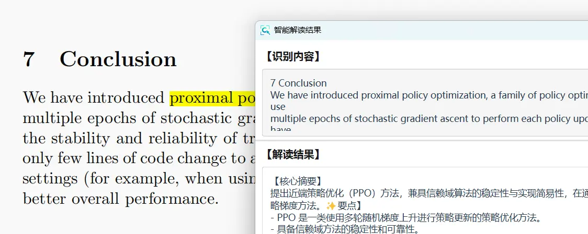

# 💡 智能解读

基于大语言模型的智能内容分析，深度理解图片中的文本内容。

## 快速开始

| 快捷键 | 功能 |
|--------|------|
| **Ctrl+I** | 截图编辑窗口中触发智能解读 |

## 使用方法

1. 按 **F1** 截取包含内容的图片
2. 在编辑窗口按 **Ctrl+I** 或点击"解读"按钮
3. AI 实时分析并流式输出结果
4. 查看解读内容，点击"复制"保存

## 主要功能

### 🧠 深度分析
- 语义理解：理解上下文和语义关系
- 多模态融合：结合 OCR 与 AI 语义分析
- 逻辑推理：提供实用建议和解释

### ⚡ 实时交互
- 流式输出：实时显示分析过程
- 即时复制：一键复制解读结果
- 图文对照：左图右文，便于对照

## AI 服务

### PixWit AI（推荐）
- ✅ 无需配置，开箱即用
- ✅ 完全免费
- ✅ 专门优化
- ⚠️ 需要联网

### 自定义服务
支持多种 AI 服务：

#### DeepSeek
- 强大的推理能力
- 性价比高
- 需要 API Key

#### 通义千问
- 阿里云服务，稳定可靠
- 企业级服务质量
- 需要 API Key

## 服务配置

设置中心 → 🤖 AI 服务配置：
1. 选择服务来源（PixWit AI / 自定义）
2. 如使用自定义服务，配置 API Key
3. 点击"测试"验证配置
4. 选择默认使用的模型

## 应用场景

### 文档理解
- 分析复杂文档
- 提取关键信息
- 总结要点

### 图表解读
- 解释数据图表
- 分析趋势走向
- 提供见解

### 问题解答
- 解答截图中的问题
- 提供详细说明
- 给出建议方案

## 使用技巧

### 提高分析质量
- 截取清晰完整的内容
- 确保文字可识别
- 包含必要的上下文

### 优化响应速度
- 避免截取过大图片
- 使用 PixWit AI 服务
- 保持网络畅通

## 常见问题

### Q：分析结果不准确？
- 确保截图内容完整清晰
- 检查 OCR 识别是否准确
- 尝试不同 AI 服务

### Q：响应速度慢？
- 检查网络连接
- 缩小截图范围
- 避免高峰时段
