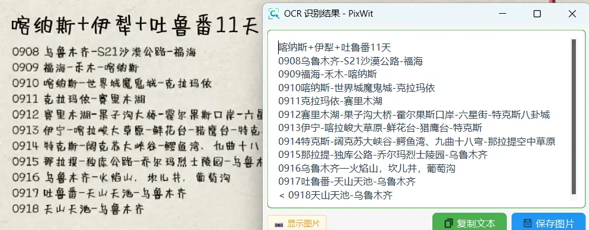

# 🔍 OCR 文字识别

PixWit 内置 OCR 文字识别功能，可以快速识别图片中的文字并复制到剪贴板。

## 使用方法

### 方法1：截图后识别

1. 按 **F1** 截图
2. 点击工具栏"**OCR**"按钮
3. 等待识别完成

## OCR 服务选择

| 服务 | 特点 |
|------|------|
| 本地 OCR（默认） | 离线、免费、首次需下载模型(~18MB) |
| 百度 OCR（可选） | 云端、准确率更高、需 API 密钥 |
| Pixwit AI 服务 |   开箱即用、方便快捷、准确率更高 |

### 本地 OCR

- ✅ 完全离线，无需联网
- ✅ 隐私安全，数据不上传
- ✅ 识别速度快（约1-2秒）

**首次使用**：点击 OCR 按钮时会自动提示下载模型
