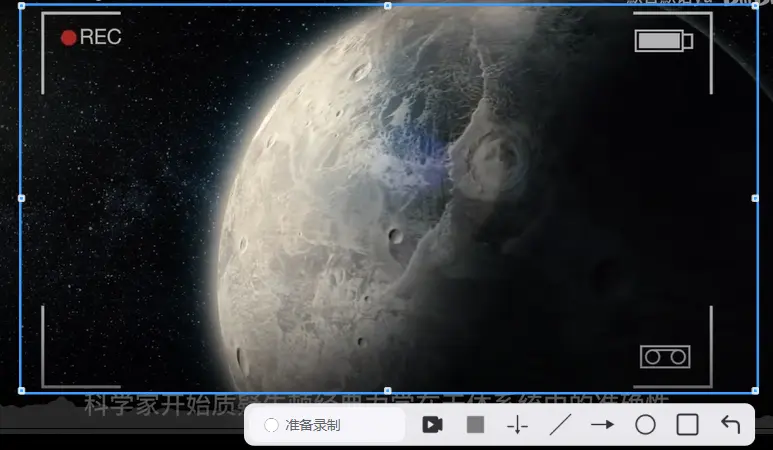

# 🎬 录屏功能

PixWit 提供专业的录屏功能，支持全屏录制、区域录制、录制时标注和智能音频检测。

## 快捷键

| 快捷键 | 功能 |
|--------|------|
| **F3** | 启动区域录制 |
| **F6** | 暂停/继续录制 |
| **F7** | 停止录制 |

## 区域录制

### 快速开始

1. **按 F3 启动区域录制**
   - 进入选区模式

2. **拖动鼠标绘制录制区域**
   - 选择要录制的屏幕区域
   - 可调整选区大小和位置

3. **点击"开始录制"按钮**
   - 3秒倒计时
   - 倒计时结束后开始录制

4. **按 F7 停止录制**
   - 录制完成，弹出保存提示
   - 可选择打开/编辑/查看文件夹

### 录制控制

| 快捷键 | 功能 | 说明 |
|--------|------|------|
| **F6** | 暂停/继续 | 暂停录制，再按继续 |
| **F7** | 停止录制 | 结束录制并保存 |
| **ESC** | 退出/停止 | 标注模式：退出标注 非标注模式：停止录制 |

::: tip 提示
录制过程中，托盘图标会显示录制状态，右键可暂停或停止
:::

## 录制时标注 🎨

在录制过程中可实时标注画面，标注会嵌入录制内容。

### 标注说明

**注意事项：**
- ✅ 标注会实时嵌入录制画面
- ⚠️ 标注期间鼠标被占用，无法进行其他操作
- 🔄 按 **Alt+Esc** 或点击工具栏"穿透"按钮恢复鼠标

**使用技巧：**
- 适合制作教程视频
- 可以圈出重点内容
- 画箭头指示操作步骤

## 全屏录制

### 操作步骤

1. **打开主界面**
   - 双击托盘图标
   - 或托盘菜单 → "打开主界面"

2. **点击"录屏"按钮**
   - 选择"全屏录制"

3. **选择屏幕**
   - 多屏用户：选择要录制的屏幕
   - 单屏用户：直接开始录制

4. **按 F7 停止录制**
   - 录制完成，保存视频

### 录制状态提示

**全屏模式特色：**
- 屏幕四周绘制闪烁边框提醒录制中
- 边框不会被录入视频
- 系统托盘显示录制时长

## 音频设置 🎤

### 智能音频检测

**首次录制：**
- 自动检测系统音频和麦克风状态
- 弹出音频设置向导
- 根据提示完成配置

**音频选项：**

| 模式 | 说明 | 适用场景 |
|-----|------|---------|
| 仅麦克风 | 录制解说 | 教程讲解、配音 |
| 仅系统声音 | 录制游戏/视频声音 | 游戏录制、演示 |
| 麦克风+系统 | 混音录制 | 带解说的游戏/软件演示 |
| 静音 | 不录制声音 | 无声演示 |

## 录制设置

### 画质设置

- **帧率**：30/60 FPS
- **质量**：高/中/低
- **编码器**：H.264

