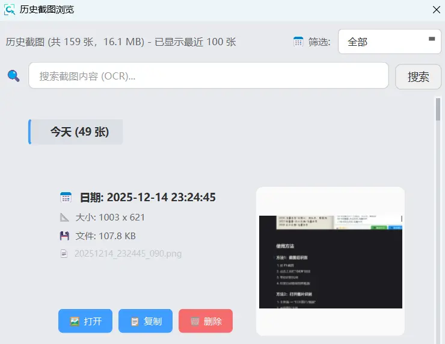

# 📸 历史截图

自动保存所有截图，支持快速查找和管理。

## 快速访问

通过系统托盘图标 → "历史截图" 进入历史记录窗口

## 主要功能

### 自动保存
- 所有截图自动保存
- 按时间排序
- 缩略图预览

### 搜索查找
- 按日期筛选
- OCR文本搜索（需启用OCR索引）
- 快速定位历史截图

### 批量管理
- 查看大图
- 复制到剪贴板
- 删除不需要的截图
- 打开文件夹

## 存储位置

默认路径：`%APPDATA%\PixWit\ScreenshotHistory\images\`

可在"设置中心 → 截图设置"中修改存储路径

## OCR 索引

启用后可通过文字内容搜索历史截图：
1. 设置中心 → 截图设置
2. 勾选"OCR 索引"
3. 历史截图将自动识别文字并建立索引