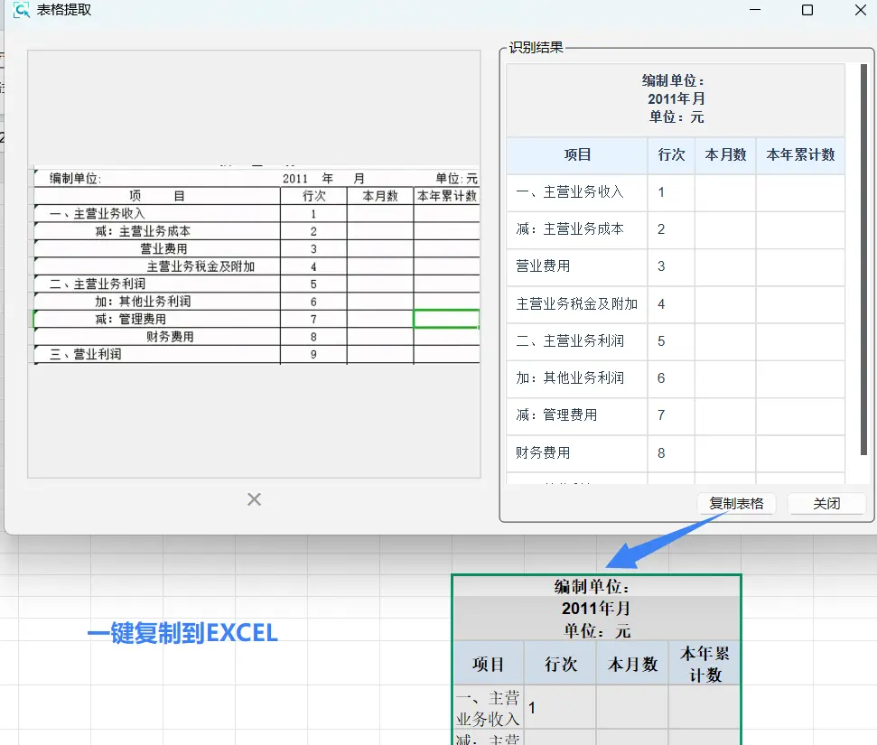

# 📊 提取表格

AI 驱动的表格识别，自动识别图片中的表格并转换为可编辑格式。

## 快速开始

| 快捷键 | 功能 |
|--------|------|
| **Ctrl+E** | 截图编辑窗口中提取表格 |

## 使用方法

1. 按 **F1** 截取包含表格的图片
2. 在编辑窗口按 **Ctrl+E** 或点击"提取表格"按钮
3. 等待 AI 识别（通常 1-3 秒）
4. 点击"复制表格"，直接粘贴到 Excel

::: tip 一键复制到 Excel
识别结果保留表格结构，可直接粘贴到 Excel、Word 等软件
:::

## 主要功能

### 🎯 智能识别
- 自动表格检测：精准识别各类表格
- 复杂表格支持：合并单元格、多行表头
- 多种格式兼容：打印表格、截图、扫描件

### 📊 格式保留
- 完整结构：保留行列结构和合并关系
- 样式美观：自动应用合适的样式
- Excel 兼容：格式完美保留

## AI 服务

### PixWit AI（推荐）
- ✅ 无需配置，开箱即用
- ✅ 完全免费
- ✅ 高准确率
- ⚠️ 需要联网

### 百度表格识别（可选）
- ✅ 企业级准确率
- ✅ 支持复杂表格
- ⚠️ 需要 API Key
- ⚠️ 按量计费

## 服务配置

设置中心 → 🤖 AI 服务配置：
1. 选择服务来源（PixWit AI / 百度表格识别）
2. 如使用百度服务，填入 API Key 和 Secret Key
3. 点击"测试"验证配置

## 提高识别率

### 截图技巧
- 表格完整，边框清晰
- 避免倾斜变形
- 背景简洁，对比度高
- 文字清晰可辨

### 支持的表格
- ✅ 规则表格（行列对齐）
- ✅ 合并单元格
- ✅ 多行表头
- ⚠️ 手绘表格（识别率较低）
- ⚠️ 无边框表格（需对齐清晰）

## 应用场景

### 数据录入
- 截图网页表格，快速导入 Excel
- 扫描纸质表格，转为电子版
- 避免手动逐个输入

### 报表处理
- 提取 PDF 中的表格
- 整理多个来源的数据
- 统一格式批量处理

### 文档整理
- 保存邮件中的表格
- 归档聊天记录中的数据
- 快速制作电子档案

## 常见问题

### Q：识别不准确？
- 确保表格边框清晰
- 避免截图倾斜
- 提高图片清晰度
- 尝试不同 AI 服务

### Q：合并单元格识别错误？
- 确保合并单元格边界清晰
- 使用百度表格识别服务
- 识别后手动微调

### Q：能识别多个表格吗？
- 建议分别截取
- 一次识别一个表格
- 避免多表格混淆
