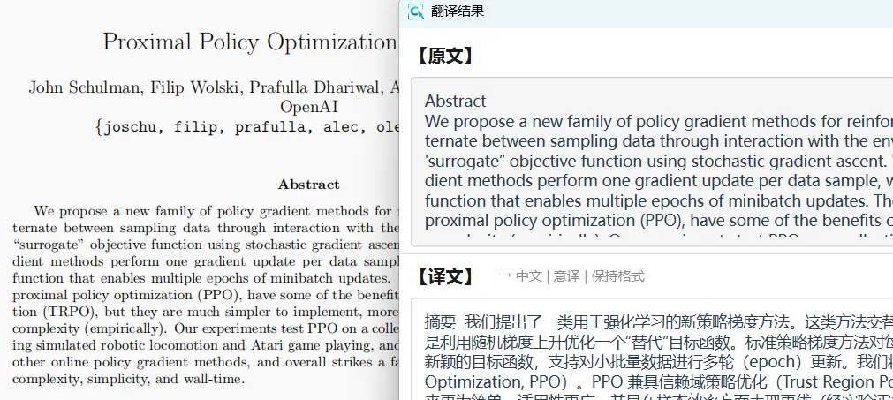

# 🌐 图片翻译

PixWit 内置 AI 智能翻译功能，可以自动识别图片中的外语文字并翻译成中文。

## 使用方法

1. 按 **F1** 截取包含外语文字的图片
2. 点击工具栏"**翻译**"按钮（🌐 图标）
3. 自动 OCR 识别并翻译成中文
4. 查看翻译结果（原文和译文对照）

::: tip 自动流程
点击"翻译"按钮后，系统自动完成：OCR 识别 → AI 翻译 → 显示结果
:::

