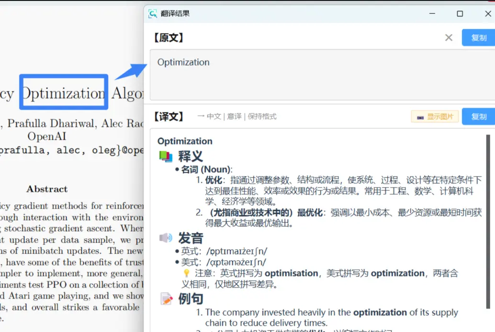

# 🌐 图片翻译

- AI 智能翻译，自动识别图片中的外语文字并翻译。

- 单词解释

## 快速开始

| 快捷键 | 功能 |
|--------|------|
| **Ctrl+T** | 截图编辑窗口中触发翻译 |

## 使用方法

1. 按 **F1** 截取包含外语文字的图片
2. 在编辑窗口按 **Ctrl+T** 或点击"翻译"按钮
3. 自动识别并翻译
4. 查看原文和译文对照

::: tip 自动流程
OCR 识别 → AI 翻译 → 显示结果，一键完成
:::

## 翻译设置

设置中心 → 🤖 AI 服务配置 → 翻译设置：

### 目标语言
- 中文（默认）
- 英文
- 其他语言

### 翻译风格
- **意译**（推荐）：流畅自然，符合中文习惯
- **直译**：逐字对应，保留原文结构
- **本地化**：适应本地文化表达

### 格式保留
- 勾选后保留原文段落格式
- 适合翻译文档、文章

## AI 服务

翻译功能需要 AI 服务支持：

### PixWit AI（推荐）
- ✅ 无需配置，开箱即用
- ✅ 完全免费
- ⚠️ 需要联网

### 自定义服务
- 通义千问、DeepSeek 等
- 需配置 API Key
- 更高的翻译质量

## 常见问题

### Q：翻译不准确？
- 确保原文清晰可识别
- 尝试不同翻译风格
- 使用自定义 AI 服务

### Q：支持哪些语言？
- 英文 → 中文（最佳）
- 日文、韩文 → 中文
- 其他语言根据 AI 服务能力

### Q：能翻译长文本吗？
- 可以，但建议分段截取
- 避免单次翻译过长内容
